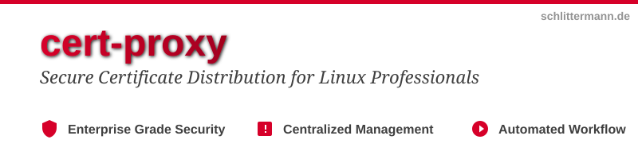

# CERT-PROXY

Cert-proxy distributes TLS certificates from a central server to remote
systems that cannot obtain certificates from Let's Encrypt directly
(e.g., systems behind firewalls, without DNS access, or with limited
ACME challenge capabilities).

A separate ACME client (e.g., dehydrated) obtains and renews certificates
on the server. Cert-proxy then serves these certificates to authenticated
clients over mutual TLS.

```
      ┌──────────────────┐
      │ Let's Encrypt CA │
      └──────────────────┘
               ↑
               │
               ↓
      ┌────────────────────────────┐       ┌─────┐
      │ ACME client (dehydrated)   │──────→│ DNS │
      └────────────────────────────┘┐      └─────┘
       │ cert-proxy-server          │
       └────────────────────────────┘
                ↑
                │ mutual TLS
                ↓
       ┌────────────────────────────┐
       │ cert-proxy-client          │
       └────────────────────────────┘
```

Authentication is mutual: the server verifies clients via X509 certificates
issued by a local CA, and clients verify the server's identity against the
same CA. Authorization is per-domain — the server controls which client may
access which private key.


## Building

Requires Go 1.26+.

```shell
git clone https://git.schlittermann.de/heiko/cert-proxy
cd cert-proxy
make install            # installs both binaries to /usr/local/bin/
```

Individual targets:

```shell
make install-server     # server only
make install-client     # client only
make install-ca         # CA scripts to /etc/cert-proxy/ca/
```

Cross-compilation for Windows:

```shell
GOOS=windows make install   # binaries in /usr/local/bin/windows_amd64/
```

Run tests and linter:

```shell
make test               # go test ./...
golangci-lint run ./... # misspell, revive, wsl_v5
```


## Server Setup

### 1. Set up the CA

The project includes a minimal CA for issuing mutual-auth certificates:

```shell
make install-ca
cd /etc/cert-proxy/ca
cp lib/vars.sh.example lib/vars.sh
vi lib/vars.sh              # set country, org, etc.
lib/mkca                    # initialize the CA (creates ca.crt + ca.key)
```

### 2. Create the server certificate

```shell
cd /etc/cert-proxy/ca
bin/mkssl-pem cert-proxy.example.com
cp cert-proxy.example.com-ssl.pem /etc/cert-proxy/server-ssl.pem
```

The `-ssl.pem` bundle contains the certificate, private key, and CA
certificate in a single PEM file.

If the server is reachable under multiple names, pass additional SANs:

```shell
bin/mkssl-pem cert-proxy.example.com proxy.internal.example.com
```

### 3. Create the client configuration directory

```shell
install -d /etc/cert-proxy/clients
```

### 4. Start the service

```shell
systemctl enable $PWD/systemd/cert-proxy-server.service
systemctl start cert-proxy-server
```

The default systemd unit runs:

```
cert-proxy-server -verbose \
    -sslfile /etc/cert-proxy/server-ssl.pem \
    -certbase /var/lib/dehydrated/certs \
    -ccd /etc/cert-proxy/clients
```

Additional flags can be set in `/etc/default/cert-proxy-server` (variable `OPTS`).

### Server flags

| Flag | Default | Description |
|------|---------|-------------|
| `-sslfile` | `server-ssl.pem` | SSL auth file (crt+key+ca) PEM |
| `-serve` | `:4433` | Listener `[host]:port` |
| `-certbase` | `certs` | Base directory for certificates |
| `-ccd` | `clients` | Client configuration directory |
| `-verbose` | `false` | Verbose logging |


## Client Setup

### 1. Create a client certificate (on the server)

```shell
cd /etc/cert-proxy/ca
bin/mkssl-pem <client-name>
```

### 2. Authorize the client for specific domains

Create `/etc/cert-proxy/clients/<client-name>` on the server:

```
# one domain per line, comments allowed
example.com
sub.example.com
another.example.org
```

No server restart required when adding or changing client authorizations.

### 3. Deploy to the client system

Copy the following to the client:
- `<client-name>-ssl.pem` — client authentication bundle
- `cert-proxy-client` binary (or `.exe` for Windows)

### 4. Run the client

```shell
cert-proxy-client \
    -connect https://cert-proxy.example.com:4433 \
    -sslfile client-ssl.pem \
    -certbase /etc/ssl/certs \
    -verbose
```

For recurring operation, use the provided systemd timer:

```shell
systemctl enable $PWD/systemd/cert-proxy-client.timer
systemctl start cert-proxy-client.timer
```

The timer runs daily with a randomized delay of up to 2 hours.
Additional flags can be set in `/etc/default/cert-proxy-client` (variable `OPTS`).

### Client flags

| Flag | Default | Description |
|------|---------|-------------|
| `-connect` | `https://localhost:4433` | Server address |
| `-sslfile` | `client-ssl.pem` | SSL auth file (crt+key+ca) PEM |
| `-certbase` | `certs` | Base directory for downloaded certificates |
| `-format` | `PEM` (Linux), `PKCS12` (Windows) | Output format |
| `-auto` | `true` | Fetch all domains the server offers |
| `-cnfile` | | File with domain list (use `-` for stdin) |
| `-hook` | | Per-certificate hook script |
| `-shared-hook` | | Hook script called once after all certs are processed |
| `-passout` | | Password for PKCS12 bundles (see notation below) |
| `-pkcs12-compat` | `modern` (Linux), `legacy` (Windows) | PKCS12 compatibility level (`legacy`\|`modern`) |
| `-servername` | | Expected server CN (default: hostname from `-connect`) |
| `-symlink` | `true` (Linux), `false` (Windows) | Use symlinks for atomic file updates |
| `-force` | `false` | Download even if server reports not-modified |
| `-jobs` | number of CPUs | Parallel download workers |

Domains can also be passed as positional arguments:

```shell
cert-proxy-client example.com sub.example.com
```


## API

All endpoints are served over mutual TLS on port 4433.

| Endpoint | Auth | Content |
|----------|------|---------|
| `GET /v1/list` | authn | List of all available domains |
| `GET /v1/cert/<domain>` | none | Certificate PEM |
| `GET /v1/chain/<domain>` | none | CA chain PEM |
| `GET /v1/fullchain/<domain>` | none | Certificate + chain PEM |
| `GET /v1/privkey/<domain>` | authz | Private key PEM |
| `GET /v1/bundle/<domain>?format=PKCS12` | authz | PKCS12 bundle (generated on-the-fly) |

Optional query parameters for `/v1/bundle/`:

| Parameter | Values | Default | Description |
|-----------|--------|---------|-------------|
| `format` | `PKCS12`, `PFX`, `P12` | | Output format |
| `pass` | string | | Password protecting the bundle |
| `pkcs12-compat` | `legacy`, `modern` | `legacy` | Encryption algorithm (`legacy` = 3DES for Java compatibility, `modern` = AES-256) |

- **authn** — valid client certificate required
- **authz** — client must be authorized for the requested domain

The client sends `If-Modified-Since` headers; the server responds with
`304 Not Modified` when the certificate has not changed.


## Hook Scripts

### Per-domain hook (`-hook`)

Called for each domain after its certificate files are written:

```
<script> deploy_cert <DOMAIN> <KEYFILE> <CERTFILE> <FULLCHAIN> <CHAINFILE> <TIMESTAMP>
```

For PKCS12 format (see [#14](https://forgejo.schlittermann.de/heiko/cert-proxy/issues/14)):

```
<script> deploy_cert <DOMAIN> <BUNDLEFILE> <TIMESTAMP>
```

Environment variables set: `DOMAIN`, `KEYFILE`, `CERTFILE`, `FULLCHAINFILE`,
`CHAINFILE`, `BUNDLEFILE` (as applicable).

Hooks run sequentially — at no time will the hook script run in more than
one instance. However, other download workers may replace certificate files
while a hook is running.

### Shared hook (`-shared-hook`)

Called once after all per-domain hooks complete:

```
<script> shared <DOMAIN>...
```

Environment variable `DOMAINS` contains the space-separated list of all
domains.


## Password Notation

The `-passout` flag for PKCS12 protection accepts:

| Notation | Example | Source |
|----------|---------|--------|
| `pass:<password>` | `pass:secret123` | Literal value |
| `file:<path>` | `file:/etc/cert-proxy/p12pass` | Read from file |
| `env:<variable>` | `env:P12_PASSWORD` | Read from environment |


## Output Files

### PEM format (Linux default)

```
<certbase>/<domain>/cert.pem
<certbase>/<domain>/privkey.pem      (mode 0600)
<certbase>/<domain>/chain.pem
<certbase>/<domain>/fullchain.pem
```

Files are written with a timestamp infix (e.g., `cert-1714400000.pem`)
and then symlinked to the final name for atomic updates.

### PKCS12 format (Windows default)

```
<certbase>/<domain>/bundle.pfx       (mode 0600)
```


## Deployment Security & Hardening

### Certificate Storage Security

**Umask Hardening**: The cert-proxy-client hardens the umask to `0077` at startup to ensure private keys are protected from group and other read access. While the client explicitly sets file permissions to `0600`, a restrictive umask provides defense-in-depth against inadvertent exposure.

### Storage Backend Requirements

**NFS Incompatibility**: Cert-proxy-client uses `O_EXCL` for atomic file creation when symlinks are enabled. This flag is unreliable on NFS, creating a race condition where stale files accumulate or clobbered files are served. **Cert-proxy-client is not suitable for NFS-backed certificate storage.** Use local filesystems (ext4, btrfs, ZFS) for `<certbase>`.

### Error Recovery

If certificate rotation fails (timeout, disk full), timestamped intermediate files (e.g., `cert-1714400000.pem`) may be left behind. Clean up stale files:

```bash
# Remove infixed files older than 1 day
find /var/lib/cert-proxy/certs -name '*-[0-9]*.pem' -type f -mtime +1 -delete

# Or remove those older than 1 hour
find /var/lib/cert-proxy/certs -name '*-[0-9]*.pem' -type f -mmin +60 -delete
```

Timestamp-based naming prevents collisions; stale files indicate incomplete writes and can safely be removed.

### Windows Behavior

On Windows, symlink mode is disabled (`-symlink false`). Bundle files (`.pfx`) follow cleanup pattern using file age filters instead of timestamp infixes.


## Known Issues

- [#20](https://forgejo.schlittermann.de/heiko/cert-proxy/issues/20) — PKCS12 password exposed in verbose logs via URL query parameter
- [#23](https://forgejo.schlittermann.de/heiko/cert-proxy/issues/23) — Symlink replacement is non-atomic (TOCTOU race window)
- [#18](https://forgejo.schlittermann.de/heiko/cert-proxy/issues/18) — Replace openssl dependency in CA scripts with native Go implementation
- [#10](https://forgejo.schlittermann.de/heiko/cert-proxy/issues/10) — Shared hook should run only if certs are modified
- [#5](https://forgejo.schlittermann.de/heiko/cert-proxy/issues/5) — Remove certs no longer available on the server
